  

### why this orbit

{{orbit_explanation_paragraph}}

### what's at the center this week

> {{learning_focus}}

— [{{website}}]({{website_url}}) · [@{{twitter}}](https://twitter.com/{{twitter}})

  

  
  
  

---

B.Tech, Computer Science & AI — Amrita Vishwa Vidyapeetham, Amritapuri. Interested in models that generalize beyond their training distribution, and in vision systems applied to real-world, not just benchmark, problems.

**Areas I keep coming back to:**
- Continual learning — systems that adapt to concepts drifting over time instead of forgetting
- Computer vision — detection, segmentation, visual understanding
- Domain adaptation — robustness across data distributions
- Applied AI in healthcare and infrastructure

### Stack

  
  
  
  
   
  
  
  
  

  

<b>GitHub stats</b>

 

  
  

  

  

  

---

Open to conversations on AI, CV, or research collaboration — reach me at [email] · [LinkedIn]

